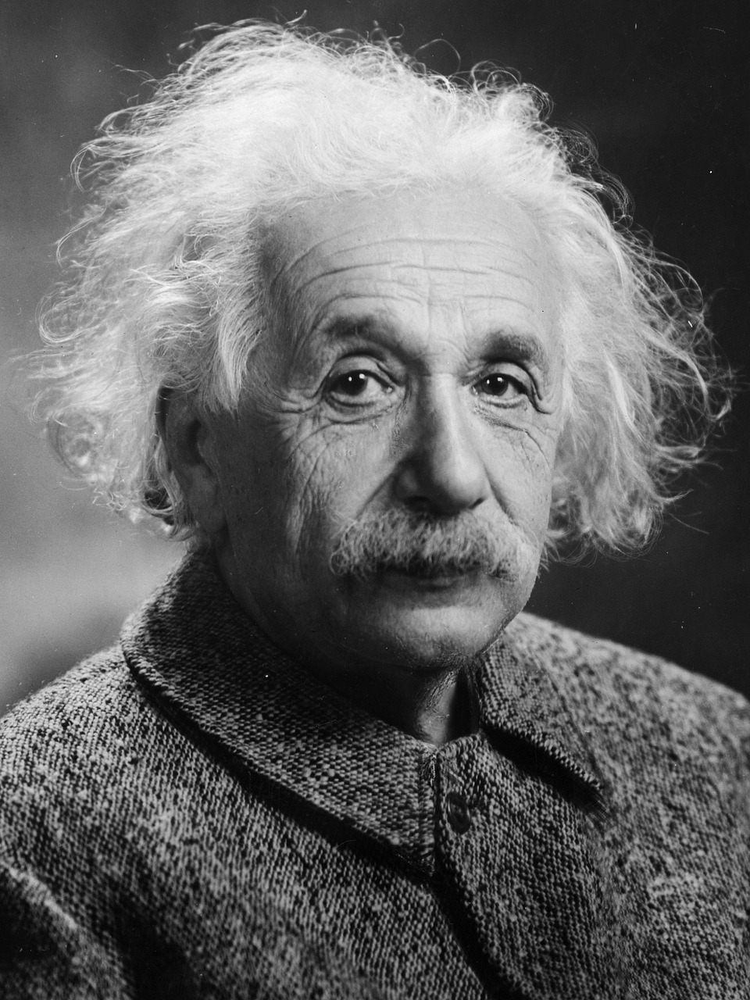
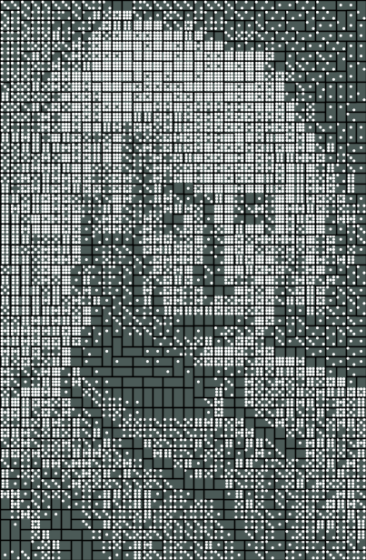

# Domino Art with Linear Optimization

Optimization can also create art!
This repository is a Python implementation of the 
[Domino Artwork](https://neos-guide.org/case-studies/cs/domino-artwork/), 
originally published by Robert Bosch.

Given a defined number of complete Domino sets, it creates an approximation of the given image
by minimizing the difference between the average brightness in each field and the number of dots on the domino which covers it.
The model ensures further that
- All domino tiles are used
- Each field is covered

With 18 Domino sets you can already achieve the following (and puzzle it at home):
<p align="center">
  
  
</p>

---

## Getting Started


This implementation requires Python 3.7+, a library for loading images (`cv2` is used here), 
and a library to build and solve linear optimization problems (`pulp` is used here).
```bash
pip install opencv-python
pip install pulp
```

- Place your image in `images/input`
- Adapt the parameters `DOMINO_SETS_USED` and `IMAGE_FILE` in `src/main.py`
- Run `src/main.py` and find the result in `images/output`

---

## References

[Original Describtion](http://www.dominoartwork.com//)

[Hosted Solver at Neos](https://neos-guide.org/case-studies/cs/domino-artwork/)